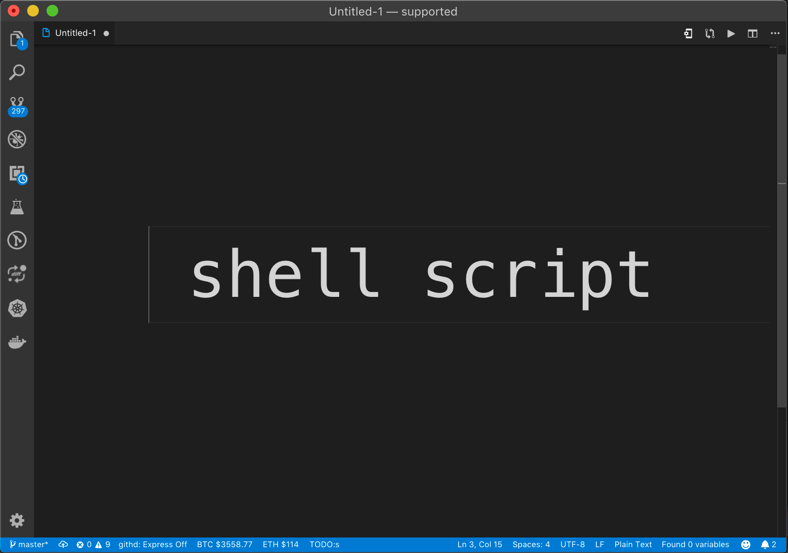

# shell-format

this is a shell script format vscode extension base [shfmt](https://github.com/mvdan/sh)

please  install shfmt before install this extension

`go get -u github.com/mvdan/sh/cmd/shfmt` 
or download excutable binary  file and config `shellformat.path` **do not require golang**
## Features
shellscript code  format

<kbd>shift</kbd>+<kbd>option</kbd>+<kbd>f</kbd> 

format current shell document

or

<kbd>shift</kbd>+<kbd>command</kbd>+<kbd>p</kbd> then type `format shell with shfmt`

## Requirements
- [golang](https://golang.org/doc/install)
- [shfmt](https://github.com/mvdan/sh#shfmt)
- Packages are available for Arch, Homebrew, NixOS and Void.

 ### you can also direct download binary excutable file  from 
  [https://github.com/mvdan/sh/releases](https://github.com/mvdan/sh/releases)
 
## advanced configuration

- `shellformat.path`the shfmt fullpath  example [mac,linux]: `/usr/local/bin/shfmt`  [windows]: `C:\\bin\\shfmt.exe`
- `shellformat.flag`shfmt -h  to see detail usage , example: `-i 4 -p`

## Release Notes

## [1.0.0] - 2017-04-06
- add command flag configuration
### [0.1.2] - 2017-01-07
- add icon & gif

### [0.1.1] - 2017-01-06
- fix document

### [0.1.0] - 2017-01-06
- change format base on TextDocument

### [0.0.1] - 2017-01-05
- add shell format base on file 

-----------------------------------------------------------------------------------------------------------

## Links

### [gitRepos](https://github.com/foxundermoon/vs-shell-format)
### [shfmt](https://github.com/mvdan/sh)

**Enjoy shellscript!**

# donate
Your donation makes `shell-format` better:

## PayPal

###    Alipay(支付宝) / Wechat(微信)

